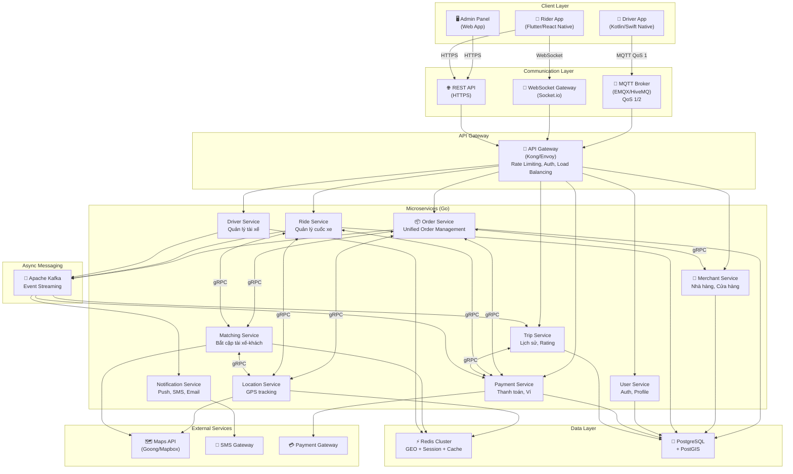
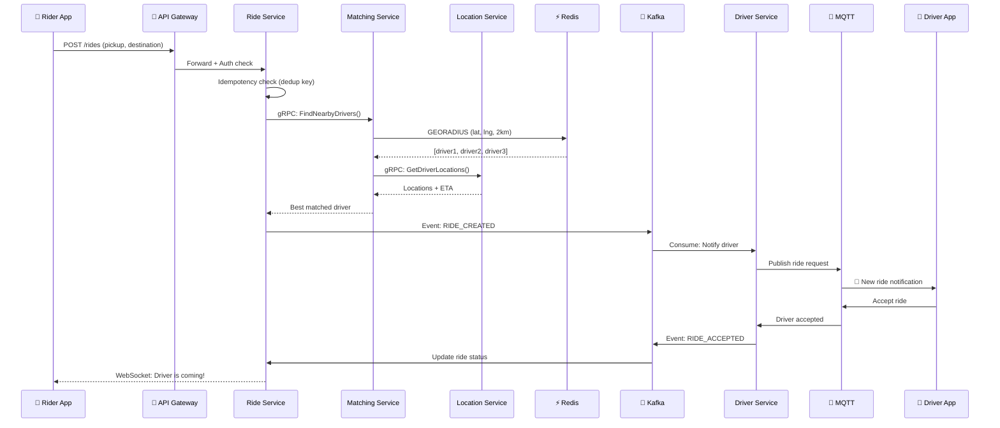
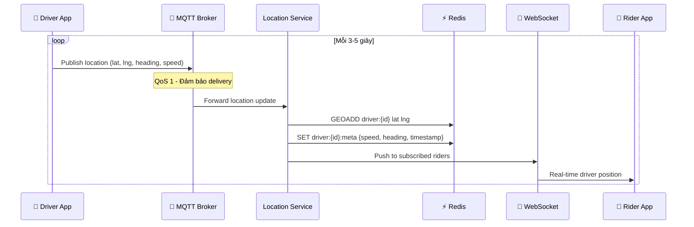
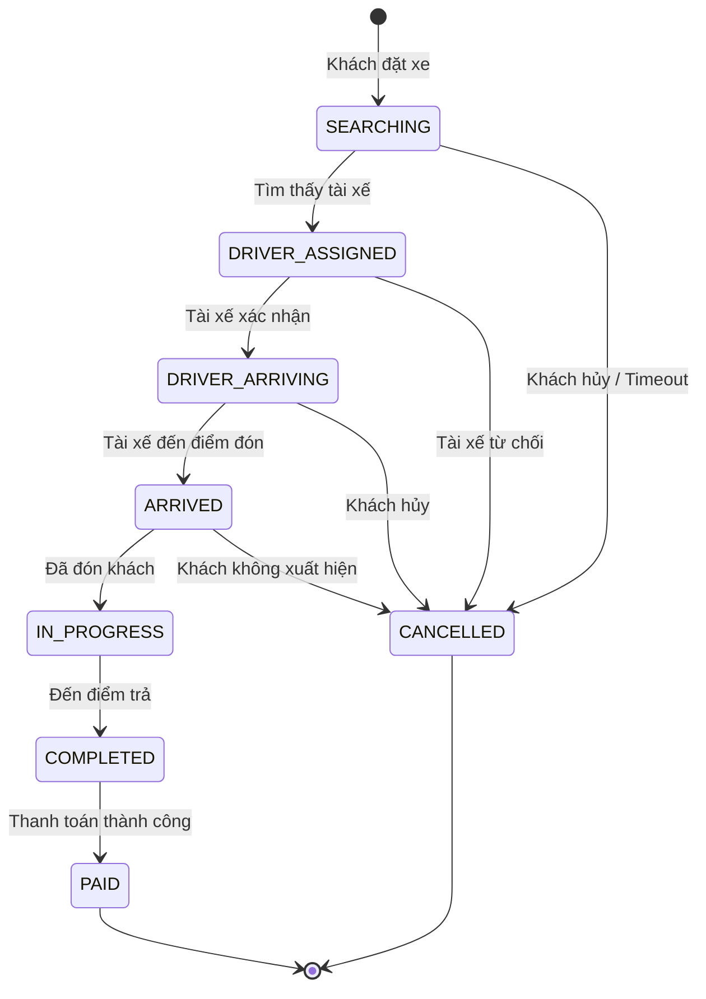

# 🏗️ Kiến trúc Tổng quan Hệ thống XeBuonHo

## Triết lý thiết kế

Hệ thống được xây dựng dựa trên **3 trụ cột**:

1. **Reliability (Độ tin cậy)**: Không bao giờ mất cuốc xe, không bao giờ sai lệch tiền
2. **Real-time Performance**: Cập nhật vị trí, trạng thái trong vài milliseconds
3. **Resilience (Khả năng phục hồi)**: Tự phục hồi khi mạng yếu, tải đột biến, hoặc service crash

## Tổng quan kiến trúc

## Luồng dữ liệu chính

### 1. Luồng đặt xe (Ride Request Flow)

### 2. Luồng cập nhật vị trí (Location Update Flow)

### 3. Luồng trạng thái chuyến xe (Trip State Machine)

## Microservices Detail

| Service | Trách nhiệm | Giao tiếp | Database |
|---------|-------------|-----------|----------|
| **Order Service** | Unified order management (4 service types) | gRPC, Kafka | PostgreSQL |
| **Merchant Service** | Nhà hàng, cửa hàng, menu | gRPC | PostgreSQL |
| **Ride Service** | Tạo/quản lý cuốc xe, orchestrator | gRPC, Kafka | PostgreSQL |
| **Driver Service** | Đăng ký, trạng thái online/offline | MQTT, gRPC | PostgreSQL |
| **User Service** | Auth, profile, OTP | REST, gRPC | PostgreSQL |
| **Payment Service** | Tính cước, ví, thanh toán | gRPC, Kafka | PostgreSQL |
| **Matching Service** | Thuật toán bắt cặp tài xế-khách | gRPC | Redis |
| **Location Service** | GPS tracking, geofencing | MQTT, gRPC | Redis |
| **Trip Service** | Lịch sử, rating, report | gRPC, Kafka | PostgreSQL |
| **Notification Service** | Push, SMS, Email | Kafka consumer | - |

## Nguyên tắc thiết kế

### Twelve-Factor App
- **Config**: Environment variables, không hardcode
- **Stateless**: Services không lưu state nội bộ, dùng Redis/DB
- **Disposability**: Service có thể restart bất cứ lúc nào

### Domain-Driven Design (DDD)
- Mỗi service sở hữu domain và database riêng
- Communication qua gRPC (sync) và Kafka events (async)
- Không truy cập trực tiếp database của service khác

### Circuit Breaker Pattern
- Khi một service downstream bị lỗi, tự động "ngắt mạch"
- Fallback gracefully thay vì cascade failure
- Tự động retry và phục hồi khi service healthy trở lại
