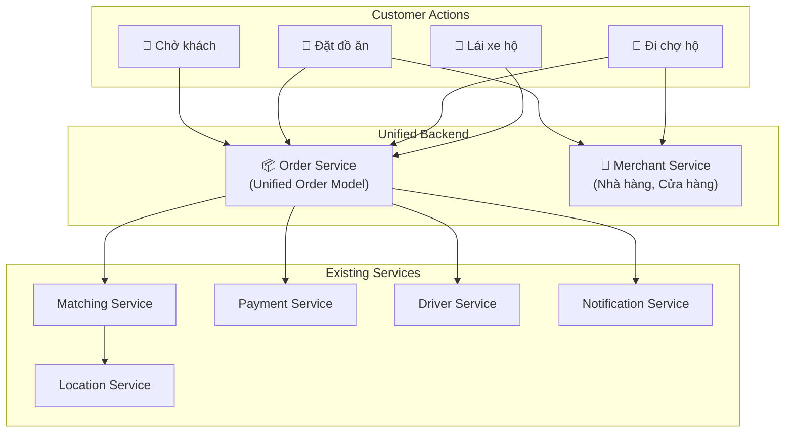
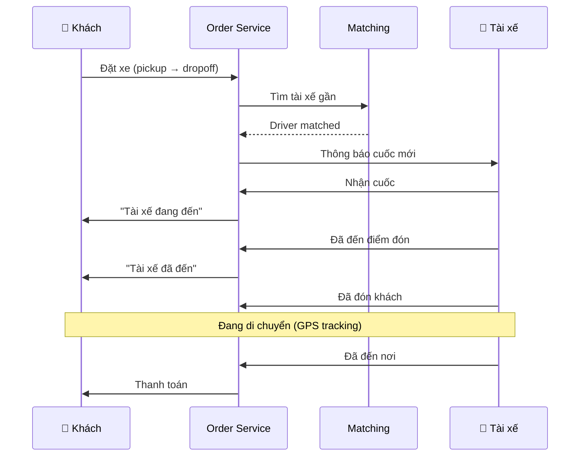
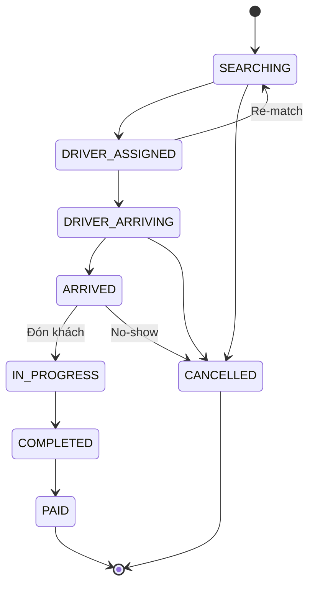
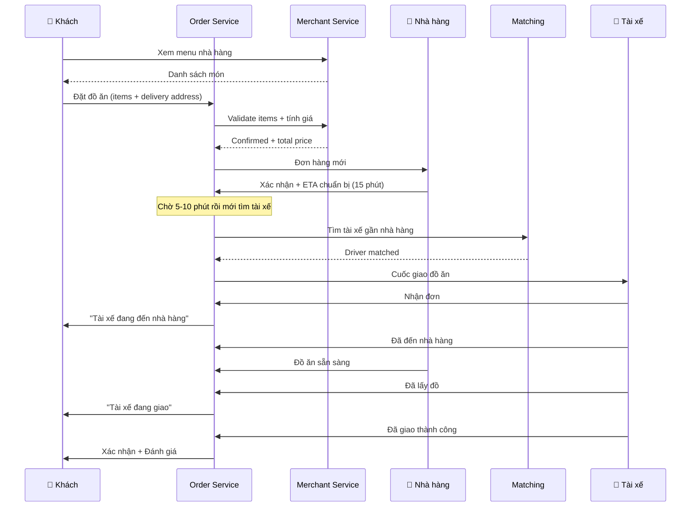
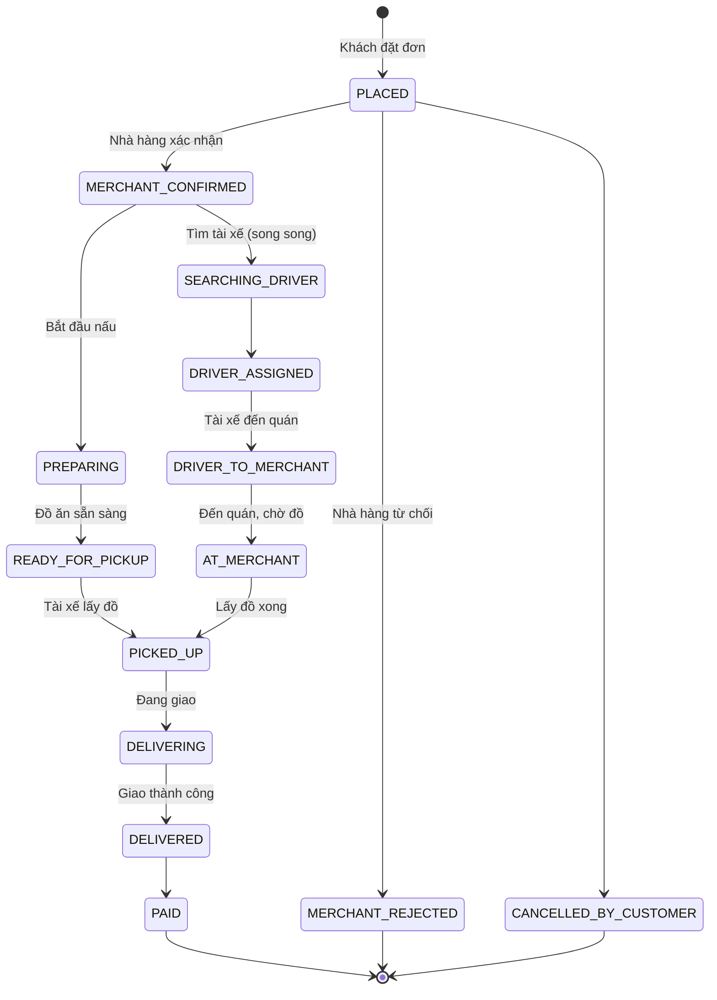
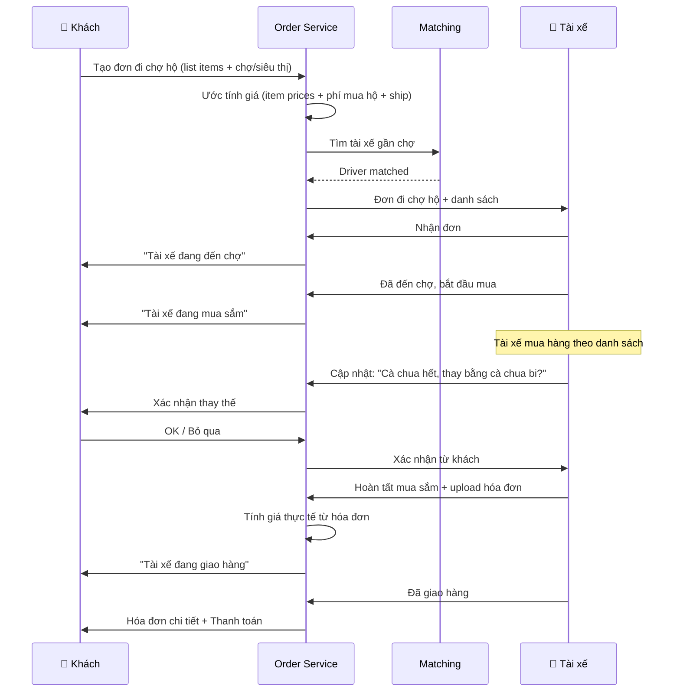
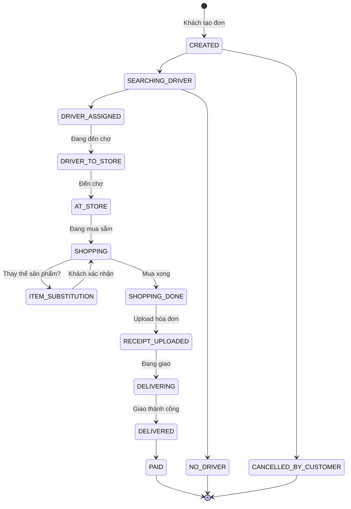
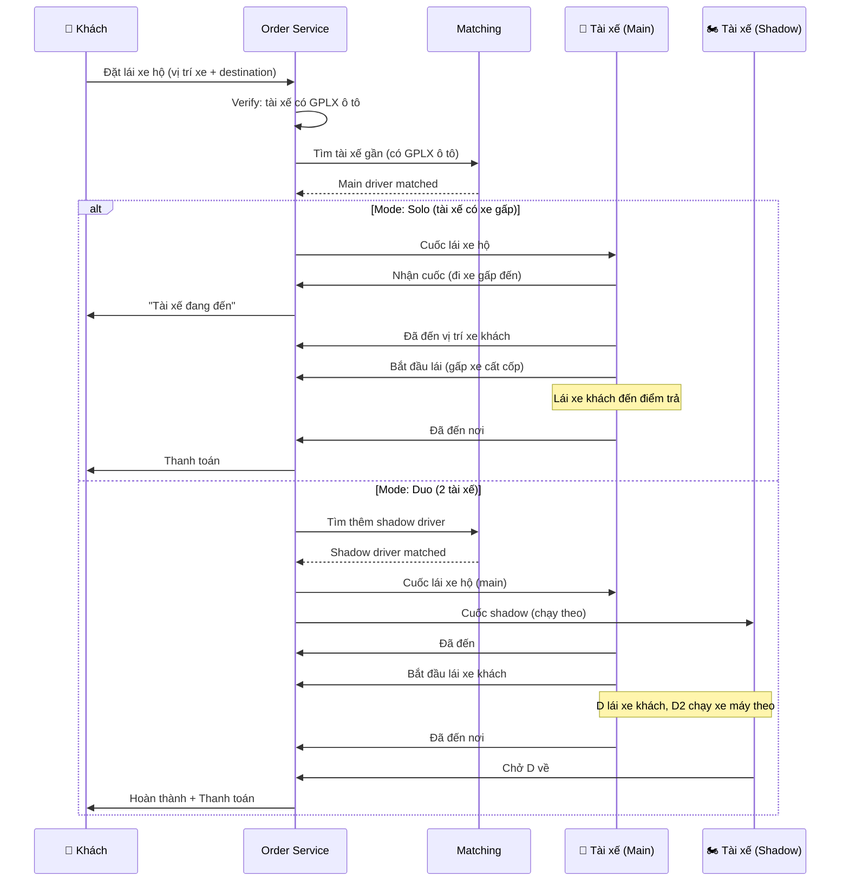
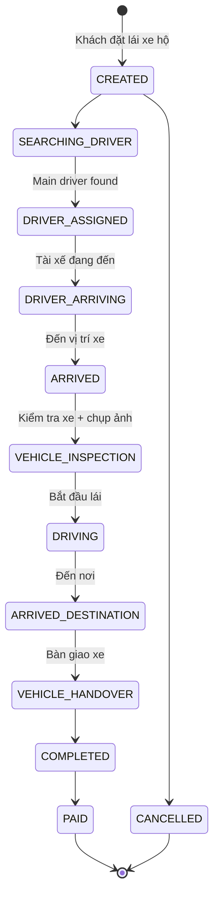

# 📦 Multi-Service Architecture (Super App)

> XeBuonHo hỗ trợ 4 loại dịch vụ: **Chở khách**, **Đặt đồ ăn**, **Đi chợ hộ**, **Lái xe hộ**.

## Tổng quan Unified Order Model

Tất cả 4 loại dịch vụ đều đi qua **Order Service** duy nhất, phân biệt bằng `service_type`. Thiết kế này giúp:
- Tái sử dụng matching, payment, notification pipeline
- Tài xế có thể đăng ký nhiều service_type
- Analytics thống nhất trên 1 dashboard



---

## 1. 🚗 Chở khách (Ride-Hailing)

### Luồng hoạt động



### State Machine



### Tính giá
```
Giá = Base fare + (Km × Rate/km) + (Phút × Rate/min) × Surge
```

---

## 2. 🍔 Đặt đồ ăn (Food Delivery)

### Đặc thù
- **3 bên**: Khách → Nhà hàng → Tài xế → Khách
- Nhà hàng phải **xác nhận** và **chuẩn bị** trước khi gọi tài xế
- Tài xế chỉ cần đến nhà hàng lấy → giao cho khách
- Khách có thể đặt nhiều món từ 1 nhà hàng

### Luồng hoạt động



### State Machine



### Tính giá
```
Giá = Tổng tiền món ăn
    + Phí đóng gói (packaging fee)
    + Phí giao hàng (distance-based)
    + Phụ thu giờ cao điểm
    - Giảm giá (voucher)
    + Phí nền tảng (commission từ nhà hàng: 15-30%)
```

### Pricing Example (VND)
| Thành phần | Giá |
|-----------|-----|
| 2x Phở bò | 80,000 |
| 1x Trà đá | 5,000 |
| Phí đóng gói | 3,000 |
| Phí giao (2.3km) | 15,000 |
| Phụ thu mưa (1.3x) | +5,000 |
| Giảm giá NEW30 | -25,000 |
| **Tổng khách trả** | **83,000** |
| Commission nhà hàng (20%) | 17,000 |

---

## 3. 🛒 Đi chợ hộ (Grocery/Errand Shopping)

### Đặc thù
- Tài xế vừa là **người mua** vừa là **shipper**
- Khách gửi **danh sách mua sắm** (shopping list)
- Tài xế phải **chụp ảnh** hóa đơn chợ để minh bạch
- Tài xế có thể **thay thế** sản phẩm nếu hết hàng (cần xác nhận khách)
- Giá thực tế có thể **khác** giá ước tính (do giá chợ biến động)

### Luồng hoạt động



### State Machine



### Tính giá
```
Giá = Tổng tiền hàng thực tế (từ hóa đơn chợ)
    + Phí mua hộ (service fee, cố định hoặc % tổng hàng)
    + Phí giao hàng (distance-based)
    + Tiền boa (optional)
    - Giảm giá
```

### Pricing Example (VND)
| Thành phần | Giá |
|-----------|-----|
| Tiền hàng (theo hóa đơn) | 250,000 |
| Phí mua hộ (15% × 250k, min 20k) | 37,500 |
| Phí giao (3.5km) | 20,000 |
| **Tổng khách trả** | **307,500** |
| Tài xế nhận (phí mua hộ + ship) | 57,500 |

---

## 4. 🚙 Lái xe hộ (Designated Driver)

### Đặc thù
- Khách có ô tô nhưng không thể lái (say rượu, mệt, không có GPLX)
- Tài xế đến **lái xe CỦA KHÁCH** từ A → B
- **Vấn đề**: Tài xế lái xong phải về → cần tài xế thứ 2 (shadow driver) chở về
- **Giải pháp**: Tài xế đi xe máy/xe đạp gập đến → gấp xe bỏ vào cốp → lái xe khách → đến nơi lấy xe máy ra đi về
- Hoặc: Đi 2 tài xế (1 lái xe khách, 1 chạy xe máy theo → chở tài xế về)

### Luồng hoạt động



### State Machine



### Vehicle Inspection (Đặc biệt)
Trước khi lái xe khách, tài xế **BẮT BUỘC** phải:
1. Chụp ảnh 4 góc xe (trước, sau, trái, phải)
2. Ghi nhận tình trạng xe (trầy xước, đèn, lốp)
3. Xác nhận km đồng hồ
→ Phòng tránh tranh chấp nếu xe bị hư hại

### Tính giá
```
Giá = Base fare (cao hơn ride thông thường)
    + (Km × Rate/km × 1.5)
    + (Phút × Rate/min × 1.2)
    + Phí chờ (nếu > 5 phút)
    + Phí shadow driver (nếu mode duo)
    + Phụ thu đêm khuya (22h-6h: +30%)
```

---

## 5. Unified Order Model

### Database Schema

```sql
-- ==========================================
-- MERCHANTS (Nhà hàng, Cửa hàng, Siêu thị)
-- ==========================================
CREATE TABLE merchants (
    id              UUID PRIMARY KEY DEFAULT gen_random_uuid(),
    owner_id        UUID REFERENCES users(id),
    name            VARCHAR(200) NOT NULL,
    description     TEXT,
    category        VARCHAR(50) NOT NULL, -- 'restaurant', 'grocery_store', 'supermarket', 'cafe'
    phone           VARCHAR(15),
    email           VARCHAR(255),
    
    -- Location
    location        GEOGRAPHY(POINT, 4326) NOT NULL,
    address         TEXT NOT NULL,
    
    -- Business info
    logo_url        TEXT,
    cover_url       TEXT,
    rating          DECIMAL(3,2) DEFAULT 5.00,
    total_orders    INTEGER DEFAULT 0,
    is_active       BOOLEAN DEFAULT TRUE,
    is_verified     BOOLEAN DEFAULT FALSE,
    
    -- Operating hours (JSONB for flexibility)
    operating_hours JSONB DEFAULT '{"mon-fri":"07:00-22:00","sat-sun":"08:00-23:00"}',
    
    -- Commission
    commission_rate DECIMAL(4,2) DEFAULT 20.00, -- Platform commission %
    
    created_at      TIMESTAMPTZ DEFAULT NOW(),
    updated_at      TIMESTAMPTZ DEFAULT NOW()
);

CREATE INDEX idx_merchants_location ON merchants USING GIST(location);
CREATE INDEX idx_merchants_category ON merchants(category);
CREATE INDEX idx_merchants_active ON merchants(is_active);

-- ==========================================
-- MENU ITEMS (Cho Food Delivery)
-- ==========================================
CREATE TABLE menu_items (
    id              UUID PRIMARY KEY DEFAULT gen_random_uuid(),
    merchant_id     UUID NOT NULL REFERENCES merchants(id) ON DELETE CASCADE,
    category_name   VARCHAR(100), -- "Món chính", "Đồ uống", "Tráng miệng"
    name            VARCHAR(200) NOT NULL,
    description     TEXT,
    price           DECIMAL(12,0) NOT NULL, -- VND
    image_url       TEXT,
    is_available    BOOLEAN DEFAULT TRUE,
    preparation_time_min INTEGER DEFAULT 15,
    
    -- Options (JSONB): sizes, toppings, etc.
    options         JSONB DEFAULT '[]',
    -- Example: [{"name":"Size","choices":[{"name":"M","price":0},{"name":"L","price":10000}]}]
    
    sort_order      INTEGER DEFAULT 0,
    created_at      TIMESTAMPTZ DEFAULT NOW(),
    updated_at      TIMESTAMPTZ DEFAULT NOW()
);

CREATE INDEX idx_menu_merchant ON menu_items(merchant_id);
CREATE INDEX idx_menu_available ON menu_items(merchant_id, is_available);

-- ==========================================
-- UNIFIED ORDERS (Tất cả 4 service types)
-- ==========================================
CREATE TABLE orders (
    id              UUID PRIMARY KEY DEFAULT gen_random_uuid(),
    idempotency_key VARCHAR(64) UNIQUE NOT NULL,
    
    -- Service type
    service_type    VARCHAR(30) NOT NULL CHECK (service_type IN (
        'ride', 'food_delivery', 'grocery', 'designated_driver'
    )),
    
    -- Participants
    customer_id     UUID NOT NULL REFERENCES users(id),
    driver_id       UUID REFERENCES users(id),
    merchant_id     UUID REFERENCES merchants(id), -- NULL for ride, designated_driver
    shadow_driver_id UUID REFERENCES users(id),     -- Only for designated_driver duo mode
    
    -- Locations
    pickup_location  GEOGRAPHY(POINT, 4326) NOT NULL,
    pickup_address   TEXT NOT NULL,
    dropoff_location GEOGRAPHY(POINT, 4326) NOT NULL,
    dropoff_address  TEXT NOT NULL,
    
    -- Vehicle
    vehicle_type    VARCHAR(20), -- 'bike','car','premium' (for ride/designated)
    
    -- State
    status          VARCHAR(40) NOT NULL DEFAULT 'created',
    
    -- Pricing
    items_total      DECIMAL(12,0) DEFAULT 0,     -- Tổng tiền món/hàng
    delivery_fee     DECIMAL(12,0) DEFAULT 0,     -- Phí giao hàng
    service_fee      DECIMAL(12,0) DEFAULT 0,     -- Phí dịch vụ/mua hộ
    surge_multiplier DECIMAL(3,2) DEFAULT 1.00,
    discount_amount  DECIMAL(12,0) DEFAULT 0,
    fare_estimate    DECIMAL(12,0) NOT NULL,       -- Tổng ước tính
    fare_final       DECIMAL(12,0),                -- Tổng thực tế
    
    -- Promo
    promo_code      VARCHAR(20),
    payment_method  VARCHAR(20) DEFAULT 'cash',
    
    -- Distance & Time
    distance_km     DECIMAL(10,2),
    duration_minutes INTEGER,
    
    -- Timestamps
    created_at       TIMESTAMPTZ DEFAULT NOW(),
    accepted_at      TIMESTAMPTZ,
    picked_up_at     TIMESTAMPTZ,
    delivered_at     TIMESTAMPTZ,
    completed_at     TIMESTAMPTZ,
    cancelled_at     TIMESTAMPTZ,
    cancelled_by     VARCHAR(20),
    cancel_reason    TEXT,
    
    -- Metadata (flexible per service_type)
    metadata        JSONB DEFAULT '{}',
    -- ride: {}
    -- food: {"packaging_fee": 3000, "merchant_prep_time": 15}
    -- grocery: {"receipt_url": "...", "substitutions": [...]}
    -- designated: {"vehicle_photos": [...], "odometer_start": 45230, "odometer_end": 45245, "shadow_mode": "solo"}
    
    updated_at      TIMESTAMPTZ DEFAULT NOW()
);

CREATE INDEX idx_orders_service_type ON orders(service_type);
CREATE INDEX idx_orders_customer ON orders(customer_id, created_at DESC);
CREATE INDEX idx_orders_driver ON orders(driver_id, created_at DESC);
CREATE INDEX idx_orders_merchant ON orders(merchant_id, created_at DESC);
CREATE INDEX idx_orders_status ON orders(status);
CREATE INDEX idx_orders_pickup ON orders USING GIST(pickup_location);
CREATE INDEX idx_orders_dropoff ON orders USING GIST(dropoff_location);

-- ==========================================
-- ORDER ITEMS (Cho Food Delivery & Grocery)
-- ==========================================
CREATE TABLE order_items (
    id              UUID PRIMARY KEY DEFAULT gen_random_uuid(),
    order_id        UUID NOT NULL REFERENCES orders(id) ON DELETE CASCADE,
    
    -- Item reference
    menu_item_id    UUID REFERENCES menu_items(id), -- NULL for grocery free-form items
    
    -- Item details (snapshot at order time)
    name            VARCHAR(200) NOT NULL,
    quantity        INTEGER NOT NULL DEFAULT 1,
    unit_price      DECIMAL(12,0) NOT NULL,
    total_price     DECIMAL(12,0) NOT NULL,
    
    -- Options chosen
    options_selected JSONB DEFAULT '[]',
    -- Example: [{"name":"Size","value":"L","price":10000}]
    
    -- Grocery specific
    unit            VARCHAR(20),  -- 'kg', 'gram', 'cái', 'bó', 'lít'
    notes           TEXT,         -- "Chọn quả chín", "Không cần túi"
    
    -- Substitution (grocery)
    is_substituted   BOOLEAN DEFAULT FALSE,
    original_name    VARCHAR(200),  -- Tên sản phẩm gốc
    substitution_approved BOOLEAN,  -- Khách đã xác nhận
    
    -- Status
    status          VARCHAR(20) DEFAULT 'pending', -- 'pending','found','not_found','substituted'
    
    created_at      TIMESTAMPTZ DEFAULT NOW()
);

CREATE INDEX idx_order_items_order ON order_items(order_id);

-- ==========================================
-- VEHICLE INSPECTIONS (Cho Lái xe hộ)
-- ==========================================
CREATE TABLE vehicle_inspections (
    id              UUID PRIMARY KEY DEFAULT gen_random_uuid(),
    order_id        UUID NOT NULL REFERENCES orders(id),
    driver_id       UUID NOT NULL REFERENCES users(id),
    
    -- Vehicle info
    license_plate   VARCHAR(20) NOT NULL,
    vehicle_model   VARCHAR(100),
    vehicle_color   VARCHAR(30),
    odometer_km     INTEGER,
    fuel_level      VARCHAR(20), -- 'full','3/4','half','1/4','empty'
    
    -- Photos (4 angles)
    photo_front_url TEXT,
    photo_back_url  TEXT,
    photo_left_url  TEXT,
    photo_right_url TEXT,
    
    -- Damage notes
    existing_damages TEXT,
    
    -- Timestamps
    inspection_at   TIMESTAMPTZ DEFAULT NOW(),
    type            VARCHAR(10) NOT NULL CHECK (type IN ('pickup', 'dropoff'))
);

CREATE INDEX idx_inspections_order ON vehicle_inspections(order_id);

-- ==========================================
-- DRIVER CAPABILITIES (Dịch vụ tài xế đăng ký)
-- ==========================================
CREATE TABLE driver_capabilities (
    driver_id       UUID NOT NULL REFERENCES users(id),
    service_type    VARCHAR(30) NOT NULL,
    is_active       BOOLEAN DEFAULT TRUE,
    verified_at     TIMESTAMPTZ,
    
    -- Extra requirements
    has_car_license  BOOLEAN DEFAULT FALSE, -- cho designated_driver
    has_bike         BOOLEAN DEFAULT FALSE, -- cho food/grocery delivery
    has_foldable_bike BOOLEAN DEFAULT FALSE, -- cho designated_driver solo mode
    max_grocery_value DECIMAL(12,0), -- Giới hạn tiền chợ tài xế ứng
    
    PRIMARY KEY (driver_id, service_type)
);

CREATE INDEX idx_driver_caps_type ON driver_capabilities(service_type, is_active);
```

---

## 6. Matching Algorithm per Service Type

### Redis Key Organization

```redis
# Tách pool tài xế theo service type
GEOADD active_drivers:ride       <lng> <lat> "driver:abc"
GEOADD active_drivers:food       <lng> <lat> "driver:def"
GEOADD active_drivers:grocery    <lng> <lat> "driver:ghi"
GEOADD active_drivers:designated <lng> <lat> "driver:jkl"

# 1 tài xế có thể ở nhiều pool
# Khi nhận cuốc → remove khỏi tất cả pools
```

### Matching Logic

| Service | Tìm tài xế gần | Thêm điều kiện |
|---------|----------------|----------------|
| Ride | Gần khách hàng | vehicle_type match |
| Food | Gần **nhà hàng** (không phải gần khách) | has_bike = true |
| Grocery | Gần **chợ/siêu thị** | max_grocery_value >= ước tính đơn |
| Designated | Gần **vị trí xe khách** | has_car_license = true |

---

## 7. Driver App - Unified Interface

```
┌──────────────────────────────────────────┐
│ Driver App Home Screen                    │
├──────────────────────────────────────────┤
│                                           │
│  Toggle Services:                         │
│  [✅ Chở khách] [✅ Giao đồ ăn]          │
│  [✅ Đi chợ hộ] [❌ Lái xe hộ]           │
│                                           │
│  ┌─ Cuốc mới ──────────────────────────┐ │
│  │ 🍔 GIAO ĐỒ ĂN                      │ │
│  │ Quán: Phở Thìn Bờ Hồ               │ │
│  │ Giao đến: 123 Lý Thường Kiệt, Q1   │ │
│  │ Thu nhập ước tính: 25,000₫           │ │
│  │ Khoảng cách: 2.3 km                 │ │
│  │                                      │ │
│  │  [❌ Từ chối]  [✅ Nhận cuốc]        │ │
│  └──────────────────────────────────────┘ │
│                                           │
│  Khi nhận cuốc grocery:                   │
│  ┌─ Danh sách mua ─────────────────────┐ │
│  │ ☐ Thịt bò Úc 500g          ~150,000│ │
│  │ ☐ Cà chua 1kg               ~25,000│ │
│  │ ☐ Rau muống 2 bó             ~10,000│ │
│  │ ☐ Nước mắm Chinsu 1 chai    ~35,000│ │
│  │                                      │ │
│  │ [📸 Chụp hóa đơn]                   │ │
│  └──────────────────────────────────────┘ │
└──────────────────────────────────────────┘
```

---

## 8. Customer App - Service Selection

```
┌──────────────────────────────────────────┐
│ App Home Screen                           │
├──────────────────────────────────────────┤
│                                           │
│  ┌────────┐ ┌────────┐                   │
│  │  🚗    │ │  🍔    │                   │
│  │Chở khách│ │Đồ ăn  │                   │
│  └────────┘ └────────┘                   │
│  ┌────────┐ ┌────────┐                   │
│  │  🛒    │ │  🚙    │                   │
│  │Đi chợ hộ│ │Lái xe hộ│                 │
│  └────────┘ └────────┘                   │
│                                           │
│  [🗺️ Bản đồ]                             │
│                                           │
└──────────────────────────────────────────┘
```
