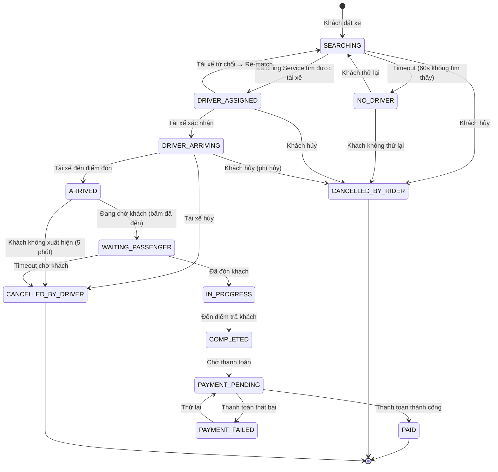

# 🔄 State Machine - Quản lý Trạng thái Chuyến xe

> **Nguyên tắc #3**: Chuyến xe phải đi theo logic **một chiều, khóa chặt**. Tài xế chưa đón khách → KHÔNG thể bấm "Hoàn thành".

## Vấn đề

```
❌ KHÔNG CÓ STATE MACHINE:
    → Tài xế hack app, bấm "Hoàn thành" ngay khi nhận cuốc
    → Hệ thống trừ tiền khách mà không đi
    → Bug cho phép status nhảy lung tung
    → Data inconsistent, không debug được

✅ CÓ STATE MACHINE:
    → Mỗi transition được validate nghiêm ngặt
    → Chỉ cho phép chuyển trạng thái hợp lệ
    → Log mọi transition để audit
    → Chặn 100% request bất hợp lệ
```

## State Diagram



## Transition Matrix

| From \ To | SEARCHING | ASSIGNED | ARRIVING | ARRIVED | IN_PROGRESS | COMPLETED | CANCELLED |
|-----------|-----------|----------|----------|---------|-------------|-----------|-----------|
| SEARCHING | - | ✅ | ❌ | ❌ | ❌ | ❌ | ✅ |
| ASSIGNED | ✅ (re-match) | - | ✅ | ❌ | ❌ | ❌ | ✅ |
| ARRIVING | ❌ | ❌ | - | ✅ | ❌ | ❌ | ✅ |
| ARRIVED | ❌ | ❌ | ❌ | - | ✅ | ❌ | ✅ |
| IN_PROGRESS | ❌ | ❌ | ❌ | ❌ | - | ✅ | ❌ |
| COMPLETED | ❌ | ❌ | ❌ | ❌ | ❌ | - | ❌ |

> ⚠️ **`IN_PROGRESS` → `CANCELLED` = KHÔNG ĐƯỢC PHÉP.** Khi đã đón khách, chỉ có thể hoàn thành.

## Go Implementation

```go
package statemachine

import (
    "fmt"
    "time"
)

// RideStatus enum
type RideStatus string

const (
    StatusSearching       RideStatus = "searching"
    StatusNoDriver        RideStatus = "no_driver"
    StatusDriverAssigned  RideStatus = "driver_assigned"
    StatusDriverArriving  RideStatus = "driver_arriving"
    StatusArrived         RideStatus = "arrived"
    StatusWaitingPassenger RideStatus = "waiting_passenger"
    StatusInProgress      RideStatus = "in_progress"
    StatusCompleted       RideStatus = "completed"
    StatusPaymentPending  RideStatus = "payment_pending"
    StatusPaid            RideStatus = "paid"
    StatusCancelledRider  RideStatus = "cancelled_by_rider"
    StatusCancelledDriver RideStatus = "cancelled_by_driver"
)

// Transition event triggers
type RideEvent string

const (
    EventDriverFound      RideEvent = "driver_found"
    EventNoDriverAvailable RideEvent = "no_driver_available"
    EventDriverAccepted   RideEvent = "driver_accepted"
    EventDriverRejected   RideEvent = "driver_rejected"
    EventDriverArrived    RideEvent = "driver_arrived"
    EventPassengerPickedUp RideEvent = "passenger_picked_up"
    EventTripCompleted    RideEvent = "trip_completed"
    EventPaymentSuccess   RideEvent = "payment_success"
    EventPaymentFailed    RideEvent = "payment_failed"
    EventRiderCancelled   RideEvent = "rider_cancelled"
    EventDriverCancelled  RideEvent = "driver_cancelled"
    EventTimeout          RideEvent = "timeout"
    EventRetry            RideEvent = "retry"
)

// Transition rules
type Transition struct {
    From    RideStatus
    Event   RideEvent
    To      RideStatus
    Guard   func(ride *Ride) error  // Điều kiện phải thỏa mãn
    Action  func(ride *Ride) error  // Side effect khi transition
}

// RideStateMachine quản lý trạng thái chuyến xe
type RideStateMachine struct {
    transitions []Transition
}

func NewRideStateMachine() *RideStateMachine {
    sm := &RideStateMachine{}
    sm.transitions = []Transition{
        // === SEARCHING ===
        {
            From: StatusSearching, Event: EventDriverFound, To: StatusDriverAssigned,
            Action: func(r *Ride) error {
                r.AssignedAt = timePtr(time.Now())
                return nil
            },
        },
        {
            From: StatusSearching, Event: EventNoDriverAvailable, To: StatusNoDriver,
        },
        {
            From: StatusSearching, Event: EventRiderCancelled, To: StatusCancelledRider,
            Action: func(r *Ride) error {
                r.CancelledAt = timePtr(time.Now())
                r.CancelledBy = "rider"
                return nil
            },
        },

        // === DRIVER_ASSIGNED ===
        {
            From: StatusDriverAssigned, Event: EventDriverAccepted, To: StatusDriverArriving,
            Action: func(r *Ride) error {
                r.AcceptedAt = timePtr(time.Now())
                return nil
            },
        },
        {
            From: StatusDriverAssigned, Event: EventDriverRejected, To: StatusSearching,
            Action: func(r *Ride) error {
                r.DriverID = nil // Clear driver, re-match
                return nil
            },
        },

        // === DRIVER_ARRIVING ===
        {
            From: StatusDriverArriving, Event: EventDriverArrived, To: StatusArrived,
            Guard: func(r *Ride) error {
                // Guard: tài xế phải ở gần điểm đón (< 200m)
                if r.DriverDistanceToPickup() > 200 {
                    return fmt.Errorf("driver too far from pickup: %.0fm", r.DriverDistanceToPickup())
                }
                return nil
            },
        },
        {
            From: StatusDriverArriving, Event: EventRiderCancelled, To: StatusCancelledRider,
            Action: func(r *Ride) error {
                r.CancelledAt = timePtr(time.Now())
                r.CancelledBy = "rider"
                r.CancelFee = calculateCancelFee(r) // Phí hủy
                return nil
            },
        },

        // === ARRIVED → IN_PROGRESS ===
        {
            From: StatusArrived, Event: EventPassengerPickedUp, To: StatusInProgress,
            Guard: func(r *Ride) error {
                if r.DriverID == nil {
                    return fmt.Errorf("no driver assigned")
                }
                return nil
            },
            Action: func(r *Ride) error {
                r.PickedUpAt = timePtr(time.Now())
                return nil
            },
        },

        // === IN_PROGRESS → COMPLETED ===
        {
            From: StatusInProgress, Event: EventTripCompleted, To: StatusCompleted,
            Guard: func(r *Ride) error {
                // Guard: chuyến đi phải ít nhất 1 phút
                if r.PickedUpAt != nil && time.Since(*r.PickedUpAt) < time.Minute {
                    return fmt.Errorf("trip too short, possible fraud")
                }
                return nil
            },
            Action: func(r *Ride) error {
                r.CompletedAt = timePtr(time.Now())
                r.FareFinal = calculateFinalFare(r)
                return nil
            },
        },

        // === COMPLETED → PAID ===
        {
            From: StatusCompleted, Event: EventPaymentSuccess, To: StatusPaid,
        },
    }
    
    return sm
}

// ProcessEvent xử lý event và transition state
func (sm *RideStateMachine) ProcessEvent(ride *Ride, event RideEvent) error {
    for _, t := range sm.transitions {
        if t.From == ride.Status && t.Event == event {
            // Run guard (nếu có)
            if t.Guard != nil {
                if err := t.Guard(ride); err != nil {
                    return fmt.Errorf("transition guard failed [%s → %s]: %w",
                        t.From, t.To, err)
                }
            }
            
            // Log transition
            oldStatus := ride.Status
            ride.Status = t.To
            ride.UpdatedAt = time.Now()
            
            // Run action (nếu có)
            if t.Action != nil {
                if err := t.Action(ride); err != nil {
                    ride.Status = oldStatus // Rollback
                    return fmt.Errorf("transition action failed: %w", err)
                }
            }
            
            // Audit log
            ride.StatusHistory = append(ride.StatusHistory, StatusEntry{
                From:      oldStatus,
                To:        t.To,
                Event:     event,
                Timestamp: time.Now(),
            })
            
            return nil
        }
    }
    
    return fmt.Errorf("invalid transition: %s + %s → ???", ride.Status, event)
}
```

## API Integration

```go
// === ride_handler.go ===

func (h *RideHandler) UpdateStatus(ctx context.Context, req UpdateStatusRequest) error {
    ride, err := h.rideRepo.GetByID(ctx, req.RideID)
    if err != nil {
        return err
    }
    
    // Map API action to event
    event, err := mapActionToEvent(req.Action)
    if err != nil {
        return err // "Invalid action"
    }
    
    // State Machine validates transition
    if err := h.stateMachine.ProcessEvent(ride, event); err != nil {
        return fmt.Errorf("cannot %s: %w", req.Action, err)
        // Example: "cannot complete_ride: transition guard failed
        //           [driver_arriving → completed]: invalid transition"
    }
    
    // Persist updated ride
    if err := h.rideRepo.Update(ctx, ride); err != nil {
        return err
    }
    
    // Publish event to Kafka
    h.eventPublisher.Publish(ctx, "ride.events", ride.ID, RideStatusChangedEvent{
        RideID:    ride.ID,
        OldStatus: ride.StatusHistory[len(ride.StatusHistory)-1].From,
        NewStatus: ride.Status,
        Timestamp: time.Now(),
    })
    
    return nil
}
```

---

## Timeout Rules

| Trạng thái | Timeout | Hành động |
|-------------|---------|----------|
| SEARCHING | 60s | → NO_DRIVER |
| DRIVER_ASSIGNED | 30s | → SEARCHING (re-match) |
| ARRIVED (chờ khách) | 5 phút | → Tài xế có quyền hủy |
| PAYMENT_PENDING | 24h | → Auto-retry hoặc chuyển sang COD |
